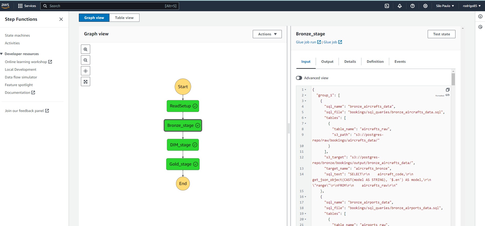
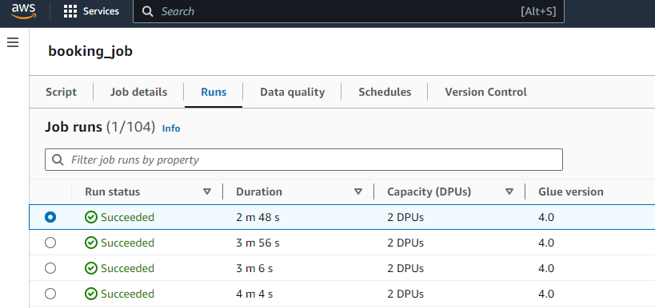
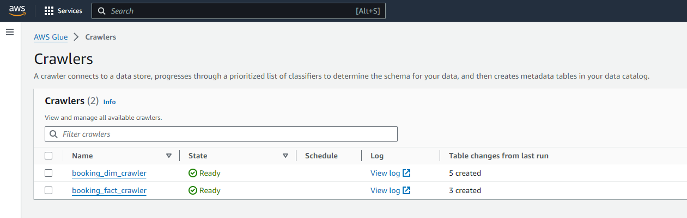
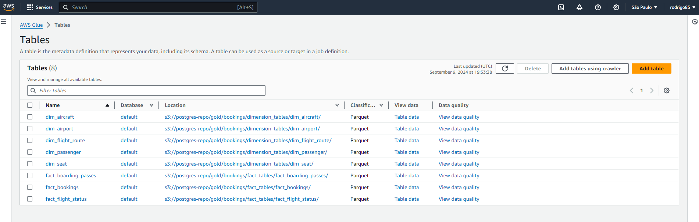
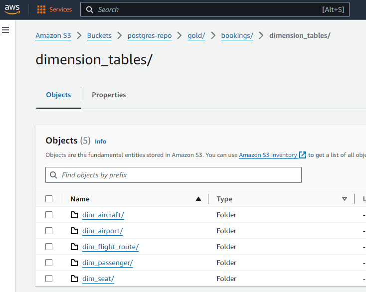
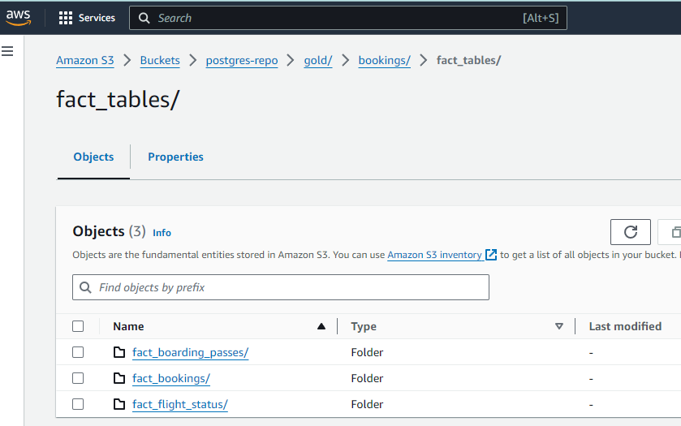
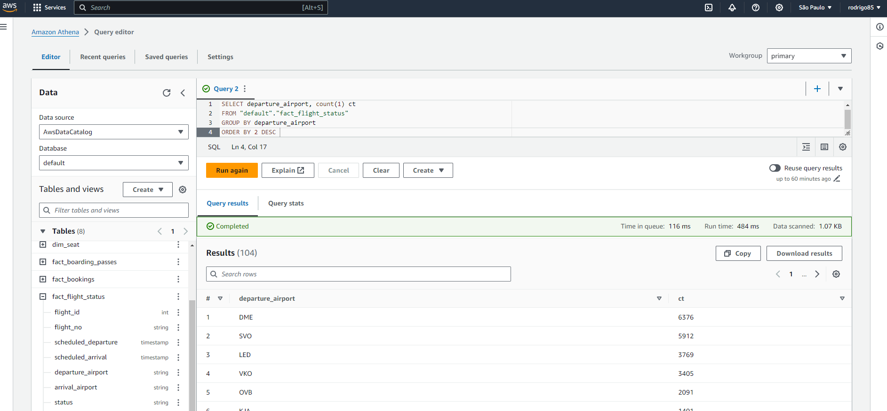

# AWS Step Function for Data Pipeline Processing 🚀

This project demonstrates the implementation of an AWS Step Function workflow that orchestrates a series of data processing tasks across multiple stages (Bronze, Dimension, Fact, and Complex Transformation). The workflow leverages AWS Lambda and Glue to handle orchestration and data transformation using PySpark.

### Table of Contents 📚
- [JSON Setup](#json-setup)
- [Explanation of Each JSON Property](#explanation-of-each-json-property)
- [Glue Job Processing](#glue-job-processing)
- [Why Use Temporary Views?](#why-use-temporary-views)
- [Step Function for SQL Execution](#step-function-for-sql-execution)
- [Validation and Test Evidence](#validation-and-test-evidence)
  - [Step Function Success](#step-function-success)
  - [AWS Glue Job 'Runs' Log](#aws-glue-job-runs-log)
  - [AWS Glue Crawlers and Table Catalog](#aws-glue-crawlers-and-table-catalog)
  - [S3 Data Storage for Dimension and Fact Tables](#s3-data-storage-for-dimension-and-fact-tables)
  - [Querying Data in Athena](#querying-data-in-athena)

### Json Setup

- **`read_setup`:** This Lambda function takes two key inputs from S3: an [**ETL stages JSON**](https://github.com/your-username/your-repo/blob/main/path/to/etl_stages.json) and a [**SQL queries JSON**](https://github.com/your-username/your-repo/blob/main/path/to/sql_queries.json). It dynamically combines these two files to group SQL queries by the ETL stage and adds the actual SQL text as the `sql_text` property.

    - **ETL Stages JSON**: This file defines the different stages in the data pipeline—`bronze_stage`, `dimension_stage`, `fact_stage`, and `complex_transformation_stage`. Each stage contains a list of datasets or operations (e.g., `bronze_aircrafts_data`, `dim_aircraft`, `fact_bookings`).

    - **SQL Queries JSON**: This file contains the details for each dataset, including:
        - The `sql_file` path, which points to the `.sql` file stored in S3.
        - The tables required to run the SQL query, along with their S3 paths for input data.
        - The target S3 location where the processed data should be written.

    **How `read_setup` works:**
    - For each stage defined in the [**ETL stages JSON**](https://github.com/your-username/your-repo/blob/main/path/to/etl_stages.json), it looks up the corresponding datasets in the [**SQL queries JSON**](https://github.com/your-username/your-repo/blob/main/path/to/sql_queries.json).
    - It fetches the actual `.sql` file from S3 (as specified in the `sql_file` property) and reads its content.
    - This SQL content is then added to the JSON output as a new property called `sql_text`.

    Example:
    For the `fact_bookings` entry in the JSON, the `read_setup` function dynamically combines the metadata and SQL content as follows:

    The result would look like this:
    ```json
    {
      "sql_name": "fact_bookings",
      "sql_file": "bookings/sql_queries/fact_bookings.sql",
      "tables": [
        {
          "table_name": "bookings_bronze",
          "s3_path": "s3://postgres-repo/bronze/bookings/output/bronze_bookings/"
        },
        {
          "table_name": "tickets_bronze",
          "s3_path": "s3://postgres-repo/bronze/bookings/output/bronze_tickets/"
        },
        {
          "table_name": "ticket_flights_bronze",
          "s3_path": "s3://postgres-repo/bronze/bookings/output/bronze_ticket_flights/"
        }
      ],
      "s3_target": "s3://postgres-repo/gold/bookings/output/fact_bookings/",
      "target_name": "bookings_gold",
      "sql_text": "SELECT
                    b.book_ref,
                    b.book_date,
                    b.total_amount,
                    t.ticket_no,
                    t.passenger_id,
                    t.passenger_name,
                    tf.flight_id,
                    tf.fare_conditions,
                    tf.amount
                FROM
                    bookings_bronze b
                JOIN
                    tickets_bronze t ON b.book_ref = t.book_ref
                JOIN
                    ticket_flights_bronze tf ON t.ticket_no = tf.ticket_no"
    }
    ```

### Explanation of Each JSON Property:

1. **`sql_name`**:  
   - **Description**: The name of the SQL query, typically corresponding to the specific dataset being processed. This is an identifier for the job.
   - **Example**: `"fact_bookings"`

2. **`sql_file`**:  
   - **Description**: The S3 path to the actual `.sql` file containing the query. The `read_setup` function reads this file from S3 and adds its content as `sql_text`.
   - **Example**: `"bookings/sql_queries/fact_bookings.sql"`

3. **`tables`**:  
   - **Description**: A list of input tables that the SQL query requires. Each table includes:
     - **`table_name`**: The name of the input table.
     - **`s3_path`**: The S3 location where the Parquet file for this table is stored.
   - **Example**:
     ```json
     [
       {
         "table_name": "bookings_bronze",
         "s3_path": "s3://postgres-repo/bronze/bookings/output/bronze_bookings/"
       },
       {
         "table_name": "tickets_bronze",
         "s3_path": "s3://postgres-repo/bronze/bookings/output/bronze_tickets/"
       }
     ]
     ```
    - **Glue Job Usage**:  
     In the Glue job, for each entry in the `tables` list, the job reads the corresponding Parquet file from S3 (using the `s3_path` property) and loads it into a Spark DataFrame. The DataFrame is then registered as a temporary table (using `createOrReplaceTempView`) with the name specified by `table_name`. This allows the SQL query (in `sql_text`) to refer to the dataset by its logical name (e.g., `bookings_bronze`), making the query execution straightforward.

       **Why this is important**:  
       Using `createOrReplaceTempView` ensures that each Parquet file is made available as a temporary view in the Spark SQL context. This method is highly efficient for handling large datasets because it allows you to perform transformations and joins on the data in-memory, without needing to persist intermediate results back to storage. This is crucial in big data pipelines, as it reduces read/write operations and improves performance by leveraging Spark’s in-memory processing capabilities.

4. **`s3_target`**:  
   - **Description**: The target S3 location where the output of the SQL query will be written after the data is processed.
   - **Example**: `"s3://postgres-repo/gold/bookings/output/fact_bookings/"`

5. **`target_name`**:  
   - **Description**: The logical name of the output dataset (e.g., the processed dataset).
   - **Example**: `"bookings_gold"`

6. **`sql_text`**:  
   - **Description**: The actual SQL query text read from the `sql_file`. This is the content that will be executed in the Glue job.
   - **Example**:
     ```sql
     SELECT
       b.book_ref,
       b.book_date,
       b.total_amount,
       t.ticket_no,
       t.passenger_id,
       t.passenger_name,
       tf.flight_id,
       tf.fare_conditions,
       tf.amount
     FROM
       bookings_bronze b
     JOIN
       tickets_bronze t ON b.book_ref = t.book_ref
     JOIN
       ticket_flights_bronze tf ON t.ticket_no = tf.ticket_no
     ```


   This dynamic combination of reading both metadata and SQL content from S3 allows the pipeline to be flexible and configurable. Any change in the SQL logic can be made by updating the SQL file in S3, without modifying the underlying code.
   
   AWS Lambda code may be find here:  [`read_setup`](https://github.com/rodrigo85/aws_step_functions/blob/23dcddf05ab76848e73284783e63f6b85d44bd90/read_setup/src/lambda_function.py).

### Glue Job Processing

The Glue job is responsible for executing the SQL queries retrieved by the `read_setup` function. Once the job is triggered, it performs the following steps:

1. **Reading Parquet Files**:
    - The Glue job reads each table specified in the `tables` list from the SQL queries JSON. These tables are stored as Parquet files in S3.
    - For each table, the job reads the corresponding Parquet file using the `s3_path` specified in the JSON, and loads the data into a Spark DataFrame.

2. **Creating Temporary Views**:
    - Once the data is loaded into a Spark DataFrame, the job registers it as a temporary view using the `table_name` from the JSON.
    - This allows the SQL query (provided in the `sql_text` property) to reference the table by name, enabling the job to perform SQL transformations using the loaded data.

3. **Executing SQL Queries**:
    - After creating the necessary temporary views for all the input tables, the job runs the SQL query specified in `sql_text`.
    - This SQL query typically involves transformations like filtering, joining, and aggregating data from the various temporary views.

4. **Writing Output**:
    - Once the SQL query is executed and a result DataFrame is generated, the Glue job writes the output to the S3 location specified by the `s3_target` property in the JSON.
    - The result is saved as a Parquet file, making it available for downstream processes or analytics.
      
  AWS Glue Job code may be find here:  [`booking_job.json`](https://github.com/rodrigo85/aws_step_functions/blob/23dcddf05ab76848e73284783e63f6b85d44bd90/booking_job.json).
   ```python
      import sys
      import json
      import time
      from pyspark.context import SparkContext
      from awsglue.context import GlueContext
      from awsglue.job import Job
      from awsglue.utils import getResolvedOptions
      
      # Initialize the Glue and Spark context
      sc = SparkContext()
      glueContext = GlueContext(sc)
      spark = glueContext.spark_session
      
      def process_job(job):
          """
          Process each SQL job: read tables, execute SQL, and write results to S3.
          """         
          sql_text = job.get('sql_text', 'No SQL text found')
          for table in job.get('tables'):
              table_name = table["table_name"]
              s3_path = table["s3_path"]
              df = spark.read.parquet(s3_path)            
              df.createOrReplaceTempView(table_name)
              print(f"Loaded Temp view '{table_name}' from {s3_path}.")
          
          result_df = spark.sql(sql_text)
          s3_target = job.get('s3_target')
          if s3_target:            
              result_df.write.mode("overwrite").parquet(s3_target)
              
          print(f"Finished processing job: {job['sql_name']}")
      
      def main():
          print("Starting job execution...")
          # Parse job arguments using getResolvedOptions
          args = getResolvedOptions(sys.argv, ['group_list', 'JOB_NAME'])
          
          # Deserialize the JSON string into a Python list of jobs
          group_jobs_json = args['group_list']
          group_jobs = json.loads(group_jobs_json)
          
          # Initialize the Glue job
          job = Job(glueContext)
          job.init(args['JOB_NAME'], {}) 
          
          # Process each job
          for job_item in group_jobs:
              process_job(job_item)          
          
          # Commit the Glue job
          job.commit()
      
      if __name__ == "__main__":
          main()
   ```

### Why Use Temporary Views?

By creating temporary views in Spark, the Glue job can work with large datasets in-memory, leveraging Spark's distributed processing capabilities. This method avoids the overhead of constantly reading and writing intermediate results to disk, significantly improving the performance of the pipeline, especially when handling large volumes of data.

The Glue job setup is dynamic because:
- It can process different SQL queries by just modifying the JSON files, without the need to update the job code.
- It can efficiently handle changes in the input data, SQL logic, or output paths, making it a flexible solution for large-scale data processing.


### Step Function for SQL Execution
The AWS Step Function orchestrates SQL execution by grouping queries into stages (Bronze, Dimension, Fact). Each stage is handled by a Glue job, and the queries are grouped into group_list arguments. The Step Function ensures that jobs run synchronously, meaning one stage must complete before the next begins, ensuring dependencies between stages are respected.

- Synchronous Execution: Using startJobRun.sync ensures that each stage (e.g., Bronze) completes before the next (e.g., Dimension) starts, maintaining the correct order of execution.
- Grouped SQL Queries: Queries are grouped by stages, allowing easy re-execution of specific stages if needed. This modular approach saves time by avoiding re-running the entire pipeline.
- Flexible Re-execution: If a stage fails, only that stage can be re-executed, improving efficiency and flexibility.


*Figure: The state machine shown here orchestrates AWS Glue jobs, ensuring that tasks are executed in the correct sequence.*

Step function workflow code may be found here:
https://github.com/rodrigo85/aws_step_functions/blob/23dcddf05ab76848e73284783e63f6b85d44bd90/MyStateMachine-SQL-Groups.asl.json#L8-L20

### <a name="validation-and-test-evidence">Validation and Test Evidence</a>

In this section, we present the results and logs that validate the success of the workflow execution and data processing.

#### Step Function Success
The diagram below showcases the successful execution of the AWS Step Function. All tasks are marked green, indicating that the entire workflow, from data ingestion to processing, completed without errors.



*Figure: AWS Step Function showing a successful run where all tasks completed successfully.*

#### AWS Glue Job 'Runs' Log
The following log screenshot demonstrates the execution of the AWS Glue jobs. It highlights job runs, durations, and completion status, confirming the data processing pipeline's stability and efficiency.



*Figure: AWS Glue Job 'Runs' log with detailed information on each job execution.*

#### AWS Glue Crawlers and Table Catalog
To automate the discovery and classification of data stored in S3, I created two AWS Glue crawlers. These crawlers scan the data sources and automatically populate the AWS Glue Data Catalog with metadata, which is essential for querying and processing data. The image below shows the list of crawlers used in the workflow.



*Figure: List of AWS Glue crawlers used to discover and catalog the data.*

After the crawlers ran successfully, the AWS Glue Data Catalog was populated with the metadata for the tables, as seen in the following image. This catalog is critical for enabling data discovery and query execution across the pipeline.



*Figure: AWS Glue Table Catalog displaying the metadata for dimension and fact tables.*

#### S3 Data Storage for Dimension and Fact Tables
The S3 bucket contains the output from the data pipeline, including both dimension and fact tables. The images below show the S3 bucket structure where these tables are stored. This confirms that the data has been processed and saved successfully.

- Dimension Tables:



*Figure: S3 bucket structure showing stored dimension tables.*

- Fact Tables:



*Figure: S3 bucket structure displaying the saved fact tables.*

#### Querying Data in Athena
To query the data, I used Amazon Athena. The tables created by the AWS Glue crawlers are available in the Athena editor, where we can execute SQL queries on the processed data. The following image shows the Athena editor with the tables available for querying.



*Figure: Athena editor displaying the tables created by the AWS Glue crawlers, allowing for data querying and analysis.*

